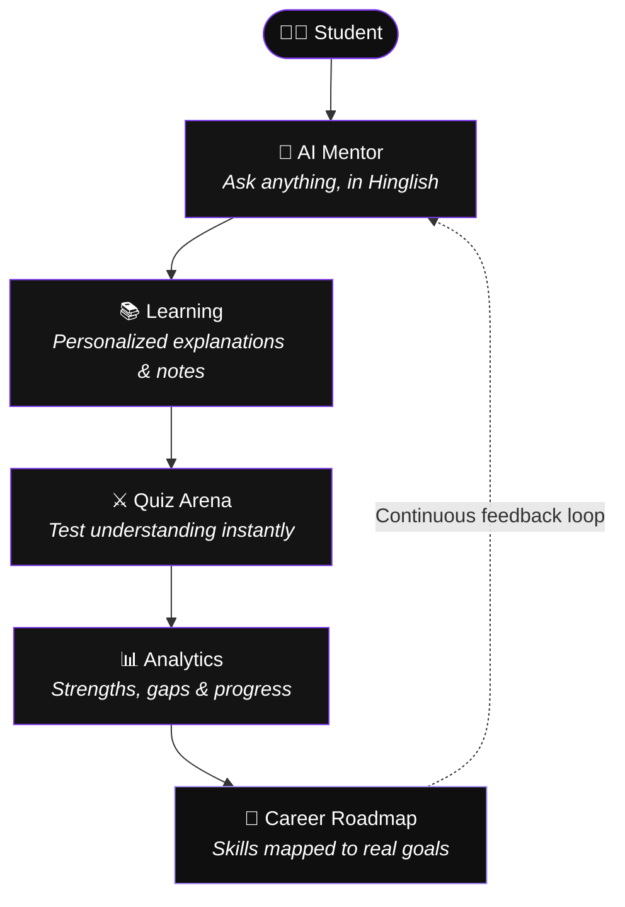
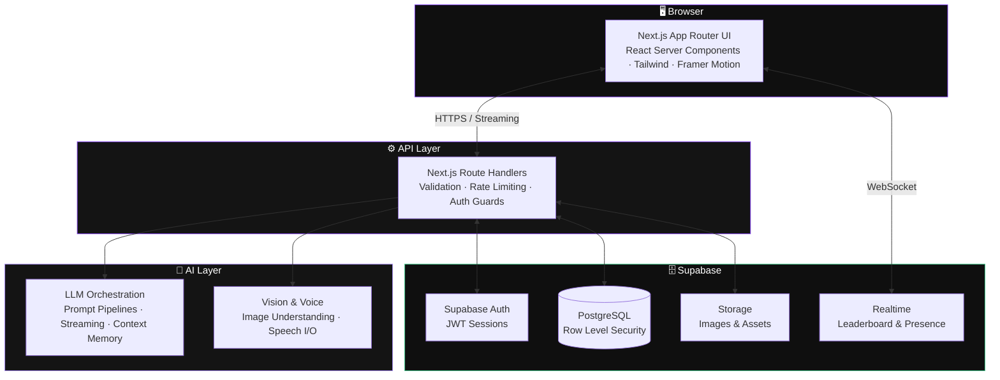

<div align="center">

<!-- ═══════════════════════════════════════════════════════════ -->
<!--                        HERO SECTION                          -->
<!-- ═══════════════════════════════════════════════════════════ -->


# Tanis Bedia

### AI Product Engineer

<p>
  <em>Building products where intelligence feels human.</em>
</p>

<br />

# MentraAI

### Your Personal AI Learning Mentor

**Learning should feel like having an intelligent mentor beside you.**

MentraAI unifies conversational AI, personalized learning, quizzes, career planning, and productivity into one modern learning platform — built for the way Indian students actually learn.

<br />

[](https://mentra-ai.vercel.app)
[](https://github.com/tanisbedia/mentra-ai/wiki)
[](https://github.com/tanisbedia/mentra-ai/issues)
[](https://github.com/tanisbedia/mentra-ai/discussions)
[](https://github.com/tanisbedia/mentra-ai/stargazers)

<br />


</div>

<br />

---

<br />

<div align="center">


<br />
<br />

<table>
  <tr>
    <td align="center"><br /><sub><b>AI Mentor</b></sub></td>
    <td align="center"><br /><sub><b>Quiz Arena</b></sub></td>
    <td align="center"><br /><sub><b>Analytics</b></sub></td>
  </tr>
</table>

</div>

<br />

---

<br />

## The Problem

Every evening, millions of students open a browser tab with a simple question — and close it two hours later, more confused than when they started.

**The system wasn't built for them.**

- ⏳ **Time evaporates.** Students spend more time *searching* for answers than *understanding* them.
- 🌊 **Information overload.** Twenty tabs, five YouTube videos, three contradicting explanations — zero clarity.
- 📋 **One-size-fits-none education.** The same lecture is delivered to the topper and the struggler. Neither is served well.
- 🧭 **No real guidance.** Career decisions worth decades are made from WhatsApp forwards and hearsay.
- 🗣️ **Language barriers.** Most world-class learning content assumes fluent English. Most Indian students think in Hinglish.
- 🤝 **No mentor.** The single biggest predictor of learning success — a patient, personal guide — is a luxury most students never get.

The talent was always there. The mentorship never was.

<br />

## The Solution

**MentraAI exists to make world-class mentorship a default, not a privilege.**

Instead of forcing students to adapt to rigid content, MentraAI adapts to the student.

- 🧠 **AI changes the economics of learning.** A mentor that is available at 2 AM, never judges, never tires, and remembers everything about your journey — at near-zero marginal cost.
- 🇮🇳 **Hinglish-first, by design.** MentraAI speaks the way Indian students actually think — fluidly mixing Hindi and English. Concepts land faster when explained in your own voice.
- 🎯 **Personalization as the core primitive.** Every explanation, quiz, and roadmap is generated from *your* level, *your* pace, and *your* goals — not a syllabus average.
- 🔁 **A closed learning loop.** Learn → test → analyze → improve. MentraAI doesn't just answer questions; it builds a compounding model of how you learn.

<br />

---

<br />

## Core Features

<table>
  <tr>
    <td width="50%" valign="top">
      <h3>🧠 AI Mentor</h3>
      <p>A conversational tutor that explains any concept at your level — in English, Hindi, or Hinglish. Context-aware, memory-driven, and endlessly patient.</p>
    </td>
    <td width="50%" valign="top">
      <h3>⚔️ Quiz Arena</h3>
      <p>AI-generated quizzes on any topic, at any difficulty. Instant explanations for every answer turn mistakes into mastery.</p>
    </td>
  </tr>
  <tr>
    <td width="50%" valign="top">
      <h3>🧭 Career Planner</h3>
      <p>Personalized career roadmaps generated from your interests, strengths, and goals — with skills, milestones, and resources mapped step by step.</p>
    </td>
    <td width="50%" valign="top">
      <h3>📝 Study Notes</h3>
      <p>AI-structured notes generated from any conversation or topic. Clean, revisable, exam-ready — and saved to your personal library.</p>
    </td>
  </tr>
  <tr>
    <td width="50%" valign="top">
      <h3>📊 Analytics</h3>
      <p>A living dashboard of your learning: accuracy trends, topic strengths, weak areas, streaks, and time invested — all visualized beautifully.</p>
    </td>
    <td width="50%" valign="top">
      <h3>🗓️ Exam Planner</h3>
      <p>Tell MentraAI your exam date and syllabus. Get a realistic, adaptive study schedule that recalibrates as you progress.</p>
    </td>
  </tr>
  <tr>
    <td width="50%" valign="top">
      <h3>🎙️ Voice Chat</h3>
      <p>Talk to your mentor naturally. Hands-free doubt solving with speech input and spoken responses — learning at the speed of conversation.</p>
    </td>
    <td width="50%" valign="top">
      <h3>🖼️ Image Understanding</h3>
      <p>Snap a photo of a textbook page, diagram, or handwritten problem. MentraAI reads it, understands it, and explains it.</p>
    </td>
  </tr>
  <tr>
    <td width="50%" valign="top">
      <h3>🏆 Gamification</h3>
      <p>XP, streaks, levels, and achievements engineered around learning science — motivation mechanics that reward consistency, not just correctness.</p>
    </td>
    <td width="50%" valign="top">
      <h3>🥇 Leaderboard</h3>
      <p>Compete with learners across India in real time. Healthy competition, weekly resets, and recognition for the most consistent minds.</p>
    </td>
  </tr>
</table>

<br />

---

<br />

## Student Journey



<br />

---

<br />

## Architecture



<br />

---

<br />

## Technology Stack

<div align="center">

#### Frontend


#### Backend


#### Database & Realtime


#### Authentication


#### AI


#### Deployment


</div>

<br />

---

<br />

## Database

MentraAI runs on **Supabase PostgreSQL** with **Row Level Security on every table** — each student can only ever touch their own data.

| Table | Purpose |
|---|---|
| `users` | Profile, preferences, language mode, XP, level, and streak state |
| `history` | Full conversational memory powering context-aware mentoring |
| `progress` | Topic-level mastery, quiz scores, and accuracy over time |
| `leaderboard` | Realtime rankings, weekly resets, and achievement records |
| `notes` | AI-generated and user-curated study notes library |
| `career_plans` | Generated roadmaps with skills, milestones, and resources |
| `exam_planner` | Exam dates, syllabus breakdowns, and adaptive schedules |

<br />

---

<br />

## Design Philosophy

> Great learning products disappear. Only the learning remains.

- 🌑 **Dark-first.** Built for late-night study sessions — reduced eye strain, deep contrast, calm focus.
- 🪟 **Glassmorphism.** Frosted layers, soft borders, and depth that guides attention without shouting.
- 🎞️ **Purposeful animation.** Motion communicates state — streaming responses, progress reveals, celebration moments. Never decoration for its own sake.
- ♿ **Accessibility.** WCAG-conscious contrast, keyboard navigation, semantic markup, reduced-motion support.
- 📱 **Mobile-first.** Most Indian students learn on a phone. Every screen is designed there first, then scaled up.
- 🫶 **Human-centered UX.** Encouraging microcopy, zero judgment on wrong answers, and interfaces that feel like a mentor — not a machine.

<br />

---

<br />

## Quick Start

> **Prerequisites:** Node.js ≥ 18 · pnpm (or npm/yarn) · A [Supabase](https://supabase.com) project · An AI provider API key

```bash
# 1 · Clone the repository
git clone https://github.com/tanisbedia/mentra-ai.git
cd mentra-ai

# 2 · Install dependencies
pnpm install

# 3 · Configure environment
cp .env.example .env.local
# → Fill in your keys (see Environment Variables below)

# 4 · Run database migrations
pnpm supabase db push

# 5 · Start the dev server
pnpm dev
```

Open **http://localhost:3000** — your mentor is ready. ✨

<br />

---

<br />

## Environment Variables

| Variable | Required | Description |
|---|:---:|---|
| `NEXT_PUBLIC_SUPABASE_URL` | ✅ | Your Supabase project URL. Safe for client exposure. |
| `NEXT_PUBLIC_SUPABASE_ANON_KEY` | ✅ | Supabase anonymous key. RLS-guarded; safe for the browser. |
| `SUPABASE_SERVICE_ROLE_KEY` | ✅ | Server-only key for privileged operations. **Never expose to the client.** |
| `AI_API_KEY` | ✅ | API key for the LLM provider powering the AI Mentor. |
| `AI_MODEL` | ⬜ | Model identifier override. Defaults to the recommended production model. |
| `NEXT_PUBLIC_APP_URL` | ✅ | Canonical app URL, used for auth redirects and metadata. |
| `RATE_LIMIT_MAX` | ⬜ | Max AI requests per user per window. Defaults to a sensible production value. |

> 🔒 All secrets live in `.env.local` (gitignored) locally and in encrypted platform variables in production. Nothing sensitive is ever committed.

<br />

---

<br />

## Deployment

#### Vercel

1. Import the repository into [Vercel](https://vercel.com/new).
2. Framework preset: **Next.js** (auto-detected).
3. Add all environment variables from the table above.
4. Deploy — every push to `main` ships automatically with preview deployments per branch.

#### Supabase

1. Create a project at [supabase.com](https://supabase.com).
2. Apply migrations: `pnpm supabase db push`.
3. Enable **Row Level Security** on all tables (enforced by the included migrations).
4. Configure Auth providers (Email, Google OAuth) and set the redirect URL to your production domain.

#### Production Checklist

- [ ] All environment variables set in Vercel (Production scope)
- [ ] RLS verified on every table
- [ ] Auth redirect URLs point to the production domain
- [ ] Rate limiting enabled on AI routes
- [ ] Realtime channels restricted to authenticated users

<br />

---

<br />

## Security

Security is a feature, not an afterthought.

| Layer | Implementation |
|---|---|
| **Authentication** | Supabase Auth with secure, httpOnly session handling |
| **Authorization** | Row Level Security policies on every table — data isolation by default |
| **Sessions** | Short-lived JWTs with automatic, silent refresh |
| **Input Validation** | Schema validation (Zod) on every API boundary — nothing untrusted reaches the AI or database |
| **Secrets** | Environment-variable isolation; service keys never leave the server |
| **API Routes** | Auth guards, per-user rate limiting, and strict CORS on all handlers |

<br />

---

<br />

## Roadmap

#### ✅ Current
- AI Mentor with Hinglish-first conversations
- Quiz Arena with instant explanations
- Career Planner & Exam Planner
- Study Notes, Analytics, Gamification & Realtime Leaderboard
- Voice Chat & Image Understanding

#### 🔜 Upcoming
- 🎙️ **AI Tutor Voice Mode** — fully spoken, back-and-forth tutoring sessions
- 👥 **Collaborative Study Rooms** — learn together, live, with a shared AI mentor
- 🃏 **AI Flashcards** — spaced-repetition decks generated from your weak topics

#### 🔮 Future
- 📴 **Offline Learning** — downloaded lessons and quizzes for low-connectivity regions
- 🔁 **AI Revision Plans** — automatic pre-exam revision cycles built from your analytics
- 💼 **AI Interview Coach** — mock interviews with real-time feedback for placements

<br />

---

<br />

## Future Vision

MentraAI is not a chatbot with a syllabus. It is the foundation of something larger.

- 🇮🇳 **India's AI Learning Platform.** One mentor, hundreds of millions of learners, every language and board — from Tier-1 metros to the smallest towns.
- 👩‍🏫 **The AI Teacher.** Not replacing educators — multiplying them. Every teacher augmented, every classroom personalized.
- 🖥️ **A Learning OS.** Notes, doubts, schedules, tests, and goals unified into a single intelligent system that knows how you learn.
- 🧭 **An AI Career Companion.** A guide that stays with students beyond the exam — from first doubt to first job, and every reinvention after.

<br />

---

<br />

## Contributing

Contributions make MentraAI better for every student. We welcome them all — code, design, docs, and ideas.

```bash
# 1 · Fork & clone
git clone https://github.com/<your-username>/mentra-ai.git

# 2 · Create a feature branch
git checkout -b feat/amazing-feature

# 3 · Commit with conventional commits
git commit -m "feat: add amazing feature"

# 4 · Push & open a Pull Request
git push origin feat/amazing-feature
```

**Guidelines**

- Follow the existing code style and TypeScript strictness
- Use [Conventional Commits](https://www.conventionalcommits.org) (`feat:`, `fix:`, `docs:`, `refactor:`)
- Keep PRs focused — one concern per pull request
- Add context: what changed, why, and screenshots for UI work
- Be kind. This project serves students; the community should feel like a mentor too.

<br />

---

<br />

## License

Released under the **[MIT License](LICENSE)** — free to use, modify, and distribute.

<br />

---

<br />

<div align="center">

<br />

**Built with ❤️ by Tanis Bedia**

*AI Product Engineer*

*Building products where intelligence feels human.*

<br />

[](https://github.com/tanisbedia)
[](https://linkedin.com/in/tanisbedia)

<br />

Part of a family of crafted products — **Synora** · **IdeaForge AI** · **Instruction Clarifier AI**

<br />

⭐ **If MentraAI helps you learn, star the repository — it helps more students find their mentor.**

<br />

</div>
